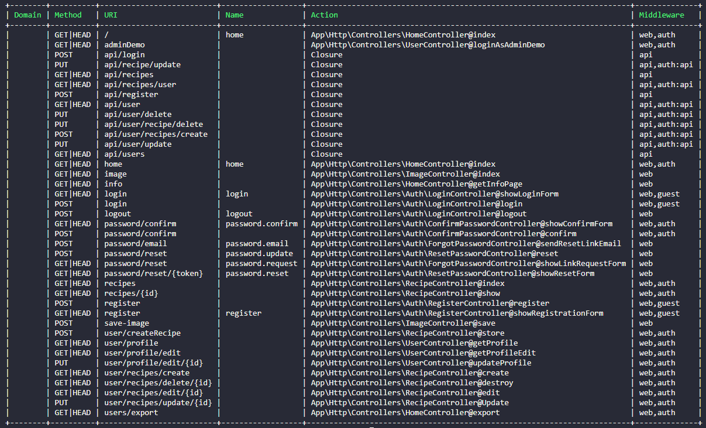
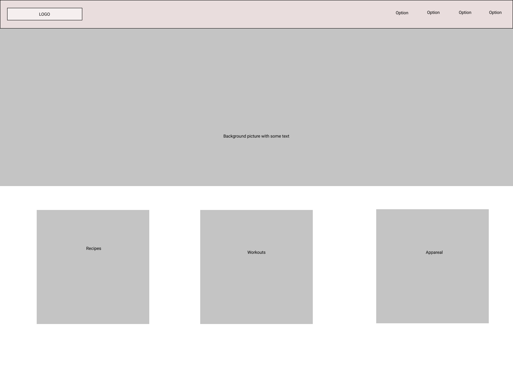
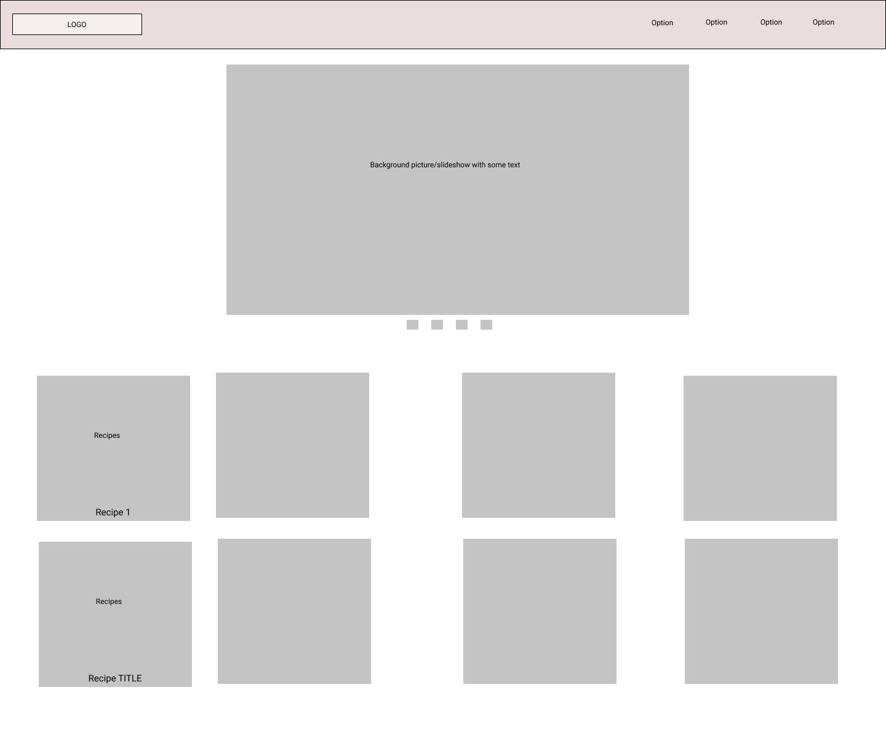
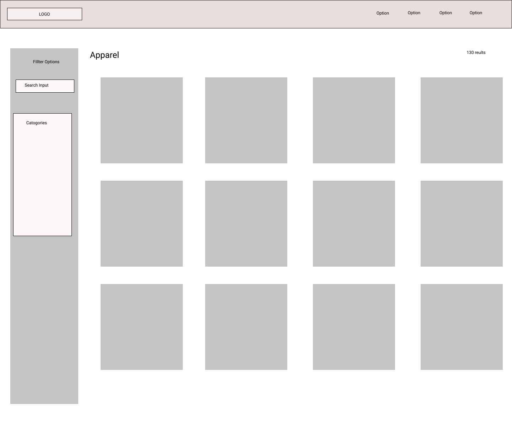

# Web_3_Aleksandra_Dimitar

## Project Description

### Technologies

- Laravel (6.*)

The goal of the project is to create health website/webshop. The project is part of Web_3 university course

### Functionalities

As of this point, the purpose of the application is to provide an access to users to a personal healthy eating blog. There they have the option to create profiles, update them (including images) and add personal recipes, which no other user can access in general.
While this may not have been achieved using the most ideal methods, the application recognises 3 types of users, depending on if and the profile they have authenticated with. the three users are as following:
- guest
- (authenticated) user
- (authenticated) admin

The aplication also provides a public api, which when running on a server, can be accessed from everyone. There are some routes that for the purpose of this project have been made public (such as getting all recipes and users), but will most likely remain restricted in a real world case. On the other hand, api authentication is also present, with the use of an api_token, which is created during registration of an account. This api token is then used to access all other api routes, which are in fact not accessible without an authentication. Both authentication and restriction of access to some resources is mostly done via middlewares (auth and auth:api), but one guard is also present in the logic behind downloading all users to excel.

## Running the application 
In order to run the application there are several steps that need to be executed:
1. Create .env file
2. Run `composer Install`
3. Run `php artisan key:generate`
4. Add the following to your .env file:

APP_NAME=Laravel
APP_ENV=local

APP_DEBUG=true
APP_LOG_LEVEL=debug
APP_URL=http://localhost

DB_CONNECTION=mysql
DB_HOST=studmysql01.fhict.local
DB_PORT=3306
DB_DATABASE=dbi392329
DB_USERNAME=dbi392329
DB_PASSWORD=Shared1234!

BROADCAST_DRIVER=log
CACHE_DRIVER=file
SESSION_DRIVER=file
QUEUE_DRIVER=sync

REDIS_HOST=127.0.0.1
REDIS_PASSWORD=null
REDIS_PORT=6379

MAIL_DRIVER=smtp
MAIL_HOST=smtp.mailtrap.io
MAIL_PORT=2525
MAIL_USERNAME=null
MAIL_PASSWORD=null
MAIL_ENCRYPTION=null

PUSHER_APP_ID=
PUSHER_APP_KEY=
PUSHER_APP_SECRET=

5. Connect to CISCO (Fontys Hera Server)
6. Run php artisan migrate:fresh
7. Optionally you could populate with fake data using User and Recipes Faker factories
8. Finally, run php artisan serve

* For testing the public api, it is adviced to use some software such as POSTMAN to generate requests
## Course Checklist (Our Remarks)
| Dimension      | Team Remarks                                                                                                                                                                                                                                                                                                                                                                                                            |
|----------------|-------------------------------------------------------------------------------------------------------------------------------------------------------------------------------------------------------------------------------------------------------------------------------------------------------------------------------------------------------------------------------------------------------------------------|
| Code Quality   | For the most part we have tried to stick to best practices and logical seperations of files insite the folder tree. We have also made use of Controllers for the local (web.php)routes We are aware of several use cases where our solution is not ideal(For example :  api.php does not use Controllers ).                                                                                                             |
| Code Quality   | We believe we have made good use of the MVC pattern. We have also made use of Eloquent/models to work with the factories and the database with improved efficiency (refering to development time). We have most likely not used helper or macro's but have made use of two middlewares : auth and auth:api                                                                                                              |
| UX             | We created a general design for our website layout in the beginning, which we used only partly, but helped us picture the website general theme to a point. For our website we took an overall conservative approach to placing our elements, looked for similar websites online and general good practices. We used just a few colors in our color palette and used bootstrap components. Our choice of colors was not random, but selected based on where we want the user to pay his attention at. Our website is also mostly responsive for smaller screen sizes as well. |
| Blade usage    | We have made use of blade engine. All our pages are blade.php files and include the template code found in ./resources/views/layout/app.blade.php                                                                                                                                                                                                                                                                       |
| Routes         | We have tried to have route URLs which are consistent and make sense for the most part. Inside web.php we have made use of                                                                                                                                                                                                                                                                                              |
| Authentication | Authentication is implemented. Forgot password page however is present, but is not working correctly when tested.                                                                                                                                                                                                                                                                                                       |
| Authorization  | Authorization was a high priority for us and is present where needed. We have made use of two middlewares auth and auth:api (which works with and api_token). We did not make use of policies or are not aware. We have made use of 1 guard , which can be found inside app/Providers/AuthService provider.php and used inside UserController.php                                                                       |
| Migrations     | All required migration functionalities are present as far as we are conserned. Those migrations could be found under database/migrations                                                                                                                                                                                                                                                                                |
| Seeds          | Seeding or populating db with data is present. We have made use of faker factories for or Recipes and User Models                                                                                                                                                                                                                                                                                                       |
## Useful info
### Route list

## Design

#### Mock-ups (From protoype)

